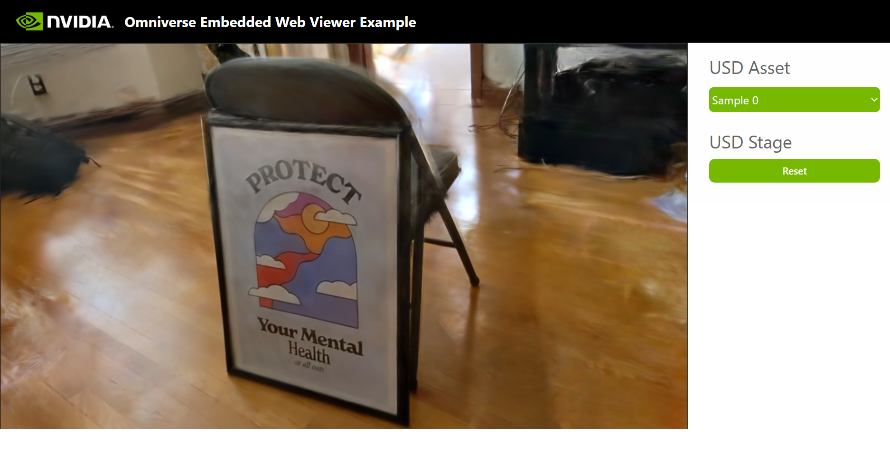

# Omniverse 3D Gaussian Splatting Streaming Example

Just a simple example using the non-official 3DGS extension ([j3soon/omni-3dgs-extension](https://github.com/j3soon/omni-3dgs-extension)) with [kit-app-template](https://github.com/NVIDIA-Omniverse/kit-app-template) and [web-viewer-sample](https://github.com/NVIDIA-Omniverse/web-viewer-sample) for web streaming.

## Prerequisites

We assume you have already ran the [Embedded Web Viewer](https://docs.omniverse.nvidia.com/embedded-web-viewer/latest/index.html) example on your machine and confirm that it works.

Preferably, you should have also ran the [Omniverse 3DGS Extension](https://github.com/j3soon/omni-3dgs-extension) to test the 3DGS renderer.

## Instructions

1. Clone the repo:

   ```sh
   git clone --recursive https://github.com/j3soon/omni-3dgs-streaming.git
   cd omni-3dgs-streaming
   ```

2. Set up 3DGS extension.

   Download sample 3DGS assets by following the instructions in the [3DGS extension repo](https://github.com/j3soon/omni-3dgs-extension?tab=readme-ov-file#setup). Specifically:

   > ```sh
   > cd omni-3dgs-extension
   >
   > wget https://github.com/j3soon/omni-3dgs-extension/releases/download/v0.0.2/assets.zip
   > unzip assets.zip
   >
   > # change the DATE_TIME to the name of the placeholder
   > DATE_TIME=2025-02-19_105311
   > cp -r ./assets/exports/poster/splatfacto/$DATE_TIME ./assets/exports/poster/splatfacto/DATE_TIME
   > DATE_TIME=2025-02-19_121606
   > cp -r ./assets/exports/poster/nerfacto/$DATE_TIME ./assets/exports/poster/nerfacto/DATE_TIME
   >
   > ls ./assets/exports/poster/splatfacto/DATE_TIME/splat/splat.ply
   > ls ./assets/exports/poster/nerfacto/DATE_TIME/tsdf/mesh.obj
   > ```

3. Run the VanillaGS renderer:

   ```sh
   cd omni-3dgs-extension
   xhost +local:docker
   docker compose build
   docker compose up
   # in a new terminal
   docker exec -it vanillags-renderer bash -ic "python /src/main.py"
   ```

   Wait for the renderer to start (seeing the `Gaussian Splatting renderer ready for requests...` message), and then run the following on host:

   ```sh
   sudo chown -R $(id -u):$(id -g) /tmp/omni-3dgs-extension
   ```

4. Build and run the Omniverse Kit app (backend):

   ```sh
   cd kit-app-template

   # Link extension
   ln -s "${PWD}/../omni-3dgs-extension/extension/exts/omni.gsplat.viewport" "${PWD}/source/extensions/omni.gsplat.viewport"

   ./repo.sh build

   mkdir -p _build/linux-x86_64/release/samples
   # Link assets
   ln -s "${PWD}/../omni-3dgs-extension/assets" "${PWD}/_build/linux-x86_64/release/samples/gsplat_assets"

   # Install dependencies
   sudo apt-get update && sudo apt-get install -y libglu1-mesa

   # Run the app
   ./repo.sh launch -- --no-window
   # and press down to select `my_company.my_usd_viewer_streaming.kit` and press enter
   ```

5. Build and run the web viewer (frontend):

   (Optional) If you want to run the web viewer on a different machine within the same local network, you can modify the `"server": "127.0.0.1"` line in the [web-viewer-sample/stream.config.json](web-viewer-sample/stream.config.json#L18) to the IP address of the machine running the Omniverse Kit app.

   ```sh
   cd web-viewer-sample
   npm install
   npm run dev -- --host
   ```
   
   > Or use docker if you don't want to install `npm` on host.
   >
   > ```sh
   > docker run --rm -it --network=host -v $PWD:/workspace node bash
   > cd /workspace
   > npm install
   > npm run dev -- --host
   > ```
   
   Open <http://localhost:5173/> and connect to the viewer.

   

## Known Issues

The Replicator still reports some errors, which breaks the alpha blending feature, but I haven't have time to investigate them yet. The error message is:

```
KeyError: '/Render/PostProcess/SDGPipeline/Replicator_DistanceToCameraSDbuffPtr'
```

which could be observed by removing the `try-except` block in the [omni.gsplat.viewport/omni/gsplat/viewport/extension.py](./omni-3dgs-extension/extension/exts/omni.gsplat.viewport/omni/gsplat/viewport/extension.py#L374-L378).

## Debugging

```sh
cd isaacsim-app-template
./repo.sh build

uv venv --python 3.10
source .venv/bin/activate
uv pip install pyzmq

./repo.sh launch -- --ext-folder /src/exts --enable omni.gsplat.viewport
```

Enable the `Script Editor` extension and run the following python code:

```py
from omni.gsplat.viewport import OmniGSplatViewportExtension
OmniGSplatViewportExtension._instance.init_streaming()
```

## License

To ensure reproducibility, we have pinned specific versions of dependencies. The licenses, versions, and commit hashes of these dependencies are listed below:

- [NVIDIA-Omniverse/kit-app-template](https://github.com/NVIDIA-Omniverse/kit-app-template) (at commit [fa73fe6](https://github.com/NVIDIA-Omniverse/kit-app-template/tree/fa73fe640e33f952ebdaebf23119c4c4d8fae169)) is released under the [NVIDIA Software License Agreement](https://github.com/NVIDIA-Omniverse/kit-app-template/blob/main/LICENSE).

  This is basically Omniverse Kit (106.5), which is the Omniverse rendering and streaming backend. This version corresponds to the Kit version used in Isaac Sim 4.5.0.

- (Unused) [Isaac Sim App Template](https://github.com/isaac-sim/isaacsim-app-template) (at commit [08187a4](https://github.com/isaac-sim/isaacsim-app-template/tree/08187a419862cf15e6758f699ab26046a2325c85)) is released under the [NVIDIA Software License Agreement](https://github.com/isaac-sim/isaacsim-app-template/blob/main/LICENSE).

  This is basically Isaac Sim 4.5.0. But isn't used in the instructions above.

- [NVIDIA-Omniverse/web-viewer-sample](https://github.com/NVIDIA-Omniverse/web-viewer-sample) (at commit [433062f](https://github.com/NVIDIA-Omniverse/web-viewer-sample/tree/433062f504e261bb9771359fe5c3831de368ddd9)) is released under the [NVIDIA Omniverse License Agreement](https://github.com/NVIDIA-Omniverse/web-viewer-sample/blob/main/LICENSE).

  This is a sample app (v1.4.1) built with React along with Vite, which is the frontend for web streaming.

Further changes based on the packages above are released under the [Apache-2.0 License](LICENSE).

## Acknowledgement

This project has been made possible through the support of [CGV Lab][cgvlab], [VMLab][vmlab], and [NVIDIA AI Technology Center (NVAITC)][nvaitc].

Special thanks to [@tigerpaws01](https://github.com/tigerpaws01) for the initial implementation of the PyGame viewer.

I would also like to thank the large-scale 3DGS Study Group members, [@Joshimello](https://github.com/Joshimello), [@Sunnyhong0326](https://github.com/Sunnyhong0326), and Ting-Yu Yan for discussions.

For a complete list of contributors to the code of this repository, please visit the [contributor list](https://github.com/j3soon/omni-3dgs-streaming/graphs/contributors).

[cgvlab]: https://cgv.cs.nthu.edu.tw
[vmlab]: https://vmlab-nthu.notion.site/NTHU-VMLab-143b8d611ddc8071ab0ede97aacfc403?pvs=4
[nvaitc]: https://github.com/NVAITC

Disclaimer: this is not an official NVIDIA product.
